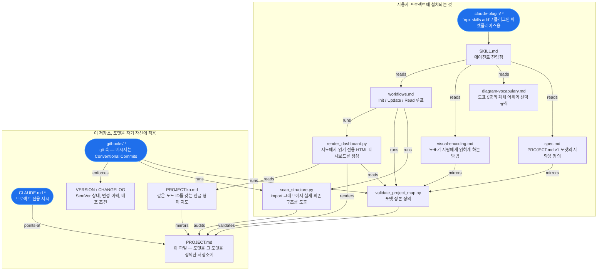

# project-map — 지도

<!-- project-map: v1 -->

## Meta
- kind: flowchart
- edges: depends-on
- edge-kinds: reads, runs, mirrors, validates, audits, points-at, enforces, renders

## Map

라벨 없는 화살표는 **depends-on** 을 뜻합니다.
`*` 아무도 의존하지 않음 — 여기서 시작 · `+` 드릴다운 지도 보유 ·
`~` 코드 없음.

## Nodes

### skill
- role: 에이전트 진입점 — 절차, 원칙, 워크플로 선택
- path: SKILL.md
- CONTRACT: frontmatter에는 `name`과 `description`만 둔다. 이 설명문이 스킬이
  검색되는 유일한 표면이므로 자연어 트리거(영/한)를 반드시 포함한다
- CONSTRAINT: 짧게 유지한다. 매 세션 로드되므로 세부는 필요할 때만 읽히는
  `references/`로 보낸다

### spec
- role: PROJECT.md v1 포맷의 사람용 정의
- path: references/spec.md
- INVARIANT: 절대 정본이 아니다 — 정본은 검증기이고 이 문서는 그 거울이다
- REJECTED: JSON/YAML 스키마를 포맷 정의로 삼는 안 — 지도를 기계 우선으로
  만들어버린다. 하나의 산출물이 사람에게 직접 쓸모 있어야 한다는 전제와 충돌

### encoding
- role: 도표가 사람에게 읽히게 하는 방법 — 라벨, 시길, 레이아웃
- path: references/visual-encoding.md
- INVARIANT: 의미를 지는 신호는 전부 라벨 안의 ASCII 텍스트다. 색과 모양은
  보조일 뿐 — 터미널 렌더러는 `classDef`를 버리고 모양을 정규화하므로, 색으로만
  전달되는 사실은 독자 절반에게 존재하지 않는다
- CONSTRAINT: 모든 시길은 원장 사실에서 파생 가능해야 한다. 아니면 검증할 수
  없고 결국 장식으로 전락한다
- REJECTED: 노드 종류를 색만으로 인코딩하는 안 — GitHub에서는 아름답지만
  터미널에서는 아무 정보도 전달하지 못한다
- REJECTED: `role:` 중복을 피하려 라벨을 id만으로 두는 안 — 검증기가 이미
  제거한 드리프트 위험을 아끼는 대신, 노드마다 원장 왕복을 강요한다

### vocabulary
- role: 도표 5종의 폐쇄 어휘와 선택 규칙
- path: references/diagram-vocabulary.md
- CONSTRAINT: 5종 고정, 엣지 의미 고정
- REJECTED: "맞는 도표를 알아서 써라" — 저자에게는 유연하지만 독자에게는
  치명적이다. 프로젝트마다 방언이 생기고 에이전트는 화살표 뜻을 추론할 수 없게 된다

### workflows
- role: Init / Update / Read 루프와 CLAUDE.md 배선 스니펫
- path: references/workflows.md
- INVARIANT: Init은 항상 검증을 통과한 뒤에야 사용자에게 지도를 보여준다
- CONTRACT: Wiring 절은 사용자 CLAUDE.md에 그대로 붙여넣을 수 있어야 한다.
  참조되지 않는 지도는 로드되지 않고 곧 죽은 무게가 된다

### scanner
- role: import 그래프에서 실제 의존 구조를 도출하고 지도를 감사
- path: scripts/scan_structure.py
- INVARIANT: 엣지는 증거가 있거나, 미증명으로 보고되거나 둘 중 하나다. "정확함"을
  에이전트의 판단이 아니라 기계적 사실로 만드는 노드
- CONSTRAINT: stdlib 전용 Python 3.8+, 설치 단계 없음. `typing.Dict` 스타일은
  의도된 선택이다
- CONSTRAINT: Python, TS/JS, Go, Rust의 import만 해석한다. 맨 패키지 명세는
  외부이며 내부 엣지가 아니다
- REJECTED: 언어별 실제 파서나 language server 연동 — 정확하지만 설치 단계를
  강요한다. 첫 접촉에서 실행되지 않는 스킬은 쓰이지 않는다
- REJECTED: `stale-edge`로 빌드를 실패시키는 안 — 지도는 import가 아닌 관계
  (spawn, HTTP 호출, 큐 쓰기)도 정당하게 그린다
- CONSTRAINT: 엄격성은 코드 유무에 비례한다. 파싱 가능한 소스가 없는 노드에서
  나가는 엣지는 `unverifiable`로 두고 문제 삼지 않는다. 마크다운 노드에는 import가
  없으니 증거를 요구하면 아무도 해소할 수 없는 지적만 쌓이고, 늘 시끄러운 보고서는
  읽는 사람을 건너뛰게 훈련시킨다 — 진짜 오류가 숨는 경로가 바로 그것이다
- REJECTED: 비-import 엣지마다 증거 유형을 적는 `EDGE:` 원장 키 — 더 정밀하지만
  엣지마다 사용자에게 일을 넘긴다. 사람이 건너뛰는 주석은 아무것도 사지 못한다.
  노드 자신의 `path:`에서 추론하면 사용자 입력이 0이다

### validator
- role: 포맷 정본 정의. 경로 부패·도표/원장 불일치·미선언 라벨에서 실패
- path: scripts/validate_project_map.py
- INVARIANT: 인식하지 못한 Mermaid 문법은 거부가 아니라 무시한다. 거짓 실패는
  사용자가 검증기를 우회하도록 가르치고, 우회된 검증기는 아무것도 지키지 못한다
- CONTRACT: 정상 0, 오류 1, 읽을 수 없는 지도 2 — 래퍼 없이 훅이나 CI에 꽂힌다
- CONSTRAINT: 의미적 드리프트는 탐지할 수 없다. 경로가 존재함을 증명할 뿐,
  설명이 여전히 그 코드를 설명하는지는 증명하지 못한다

### plugin
- role: `npx skills add` / 플러그인 마켓플레이스용 설치 매니페스트
- path: .claude-plugin/
- CONTRACT: 여기의 `version`은 `VERSION`을 따라간다. 릴리즈 시 함께 움직여야 한다

### dashboard
- role: 지도에서 읽기 전용 HTML 대시보드를 생성
- path: scripts/render_dashboard.py
- path: references/dashboard.md
- INVARIANT: 페이지는 빌드 산출물이며 입력 요소가 하나도 없다. 따라서 읽기 전용은
  UI 정책이 아니라 구조적 사실이다. 다른 페이지를 얻는 유일한 경로는 코드를 고치고,
  지도를 갱신하고, 렌더러를 다시 실행하는 것뿐이다
- INVARIANT: 검증에 실패한 지도는 렌더하지 않는다. 대시보드는 지도를 권위 있어
  보이게 만들고, 깨진 지도를 렌더하면 부패를 제품처럼 포장하게 된다
- CONSTRAINT: 검증기를 파일 경로로 로드해 그 파서를 재사용한다. 한 포맷에 파서가
  둘이면 구조적으로 갈라진다
- CONSTRAINT: Mermaid는 CDN에서 온다. 3MB를 벤더링하는 것은 설치 단계 없음이라는
  전제와 충돌하며, 불러오지 못하면 페이지가 그 사실을 명시한다
- REJECTED: 지도를 감시하는 라이브 서버 — 브라우저에서 편집하고 싶게 만든다.
  코드가 출처이고 지도는 그 기록이라는 것이 핵심이다

### self_map
- role: 이 파일 — 포맷을 그 포맷을 정의한 저장소에 적용한 결과
- path: PROJECT.md
- INVARIANT: 모든 포맷 변경은 먼저 여기서 표현 가능해야 한다. 자기지도가
  어색해진다면 그 포맷 변경이 틀린 것이다
- OWNER: 저장소 소유자

### claude_md
- role: 프로젝트 전용 지시 — 쌍의 명령형 절반
- path: CLAUDE.md
- CONTRACT: 지시만 담는다. 구조와 근거는 이 지도에 있고, 중복하면 이 포맷이
  없애려는 비동기화 문제를 다시 만든다
- REJECTED: CLAUDE.md를 PROJECT.md에 합치는 안 — 지시는 명령형이고 사용자가
  쓰지만 지도는 서술형이고 파생된다. 합치면 구조를 고칠 때마다 지시 파일이 흔들린다

### commit_gate
- role: git 훅 — 메시지는 Conventional Commits, 내용은 지도 검증과 import 감사
- path: .githooks/
- CONSTRAINT: LF 줄바꿈의 POSIX `sh`여야 한다. 아니면 git-for-windows가
  `bad interpreter`로 실패한다. `.gitattributes`로 강제
- CONTRACT: 의도적 WIP 커밋을 위해 `PROJECT_MAP_SKIP=1`을 존중한다. 탈출구 없는
  게이트는 통째로 비활성화되며 그쪽이 훨씬 나쁘다

### translation
- role: 같은 노드 ID를 갖는 한글 형제 지도
- path: PROJECT.ko.md
- CONTRACT: 노드 ID가 `PROJECT.md`와 정확히 일치해야 한다. 어긋나면 렌더러가
  빌드를 거부하므로 절반만 갱신된 번역은 배포될 수 없다
- REJECTED: 한 원장에 이중 문자열(`role.en` / `role.ko`)을 넣는 안 — 항목이 두 배가
  되고 한쪽만 고치는 순간 나머지가 썩는다. 형제 파일은 포맷을 그대로 재사용하면서
  노드 ID 집합을 비교 가능하게 만든다

### release
- role: SemVer 상태, 변경 이력, 배포 조건
- path: VERSION
- path: CHANGELOG.md
- path: LICENSE
- CONTRACT: `LICENSE`는 `.claude-plugin/plugin.json`의 `"license"`와 일치해야
  한다. MIT라고 선언만 하고 본문을 주지 않는 공개 스킬은 사용자에게 의존할 근거를
  주지 못한다
- INVARIANT: `VERSION`이 현재 버전의 단일 출처다
- CONSTRAINT: 아직 릴리즈 자동화가 없다. 레지스트리와 토큰 결정이 필요하므로
  버전 올리기는 `CONTRIBUTING.md`에 따라 수동이다
