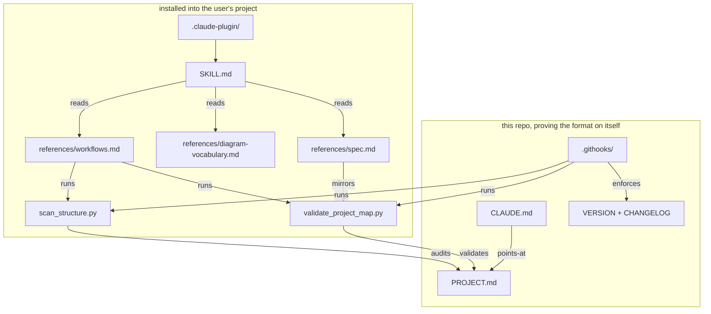

# project-map — map

<!-- project-map: v1 -->

## Meta
- kind: flowchart
- edges: depends-on
- edge-kinds: reads, runs, mirrors, validates, audits, points-at, enforces

## Map

## Nodes

### skill
- role: agent entry point — procedure, invariant principles, workflow selection
- path: SKILL.md
- CONTRACT: frontmatter carries only `name` and `description`; the description
  must contain the natural-language triggers (English and Korean) because that
  text is the entire retrieval surface for the skill
- CONSTRAINT: stays short. It is loaded every session, so detail belongs in
  `references/`, which is read on demand

### spec
- role: human-readable definition of the PROJECT.md v1 format
- path: references/spec.md
- INVARIANT: never the authority — the validator is. This file mirrors it
- REJECTED: a JSON/YAML schema as the format definition — it would have made
  the map machine-first, and the whole premise is that one artifact serves a
  human directly. Executable validator plus prose mirror keeps the artifact
  human-shaped

### vocabulary
- role: closed set of five diagram kinds and the rule for choosing one
- path: references/diagram-vocabulary.md
- CONSTRAINT: five kinds, fixed edge semantics
- REJECTED: "use whatever diagram fits" — flexible for the author, fatal for
  the reader. Every project would invent a private dialect and an agent could
  no longer infer what an arrow means without being told

### workflows
- role: the Init / Update / Read loops, including the CLAUDE.md wiring snippet
- path: references/workflows.md
- INVARIANT: Init always ends with validation before the map is shown to the user
- CONTRACT: the Wiring section is copy-pasteable into a user's CLAUDE.md; an
  unreferenced map never gets loaded and is therefore dead weight

### scanner
- role: derives the real dependency graph from the import graph, and audits a
  map against it (`--suggest` proposes, `--compare` reports drift)
- path: scripts/scan_structure.py
- INVARIANT: an edge is evidence-backed or it is reported as unverified. This is
  the node that makes "accurate" mechanical rather than a matter of agent belief
- CONSTRAINT: stdlib-only Python 3.8+, no install step, so `typing.Dict` style
  is deliberate
- CONSTRAINT: resolves Python, TS/JS, Go, and Rust imports only; bare package
  specifiers are external and never internal edges
- REJECTED: a real per-language parser or language-server integration — correct
  but it would impose an install step, and a skill that cannot run on first
  contact will not be used
- REJECTED: failing the build on `stale-edge` — a map legitimately draws
  relationships that are not imports (spawns, HTTP calls, queue writes), so
  unverified edges are reported, never blocked

### validator
- role: canonical format definition; fails on path rot, diagram/ledger
  mismatch, unknown keys, and undeclared edge labels
- path: scripts/validate_project_map.py
- INVARIANT: unrecognized Mermaid syntax is ignored, never rejected. A false
  failure teaches users to bypass the validator, and a bypassed validator
  protects nothing
- CONTRACT: exit 0 clean, 1 errors, 2 unreadable map — so it drops into any
  hook or CI without a wrapper
- CONSTRAINT: cannot detect semantic drift; it proves a path exists, not that
  the node's description still describes it. Never claim otherwise

### plugin
- role: install manifests for `npx skills add` / plugin marketplace
- path: .claude-plugin/
- CONTRACT: `version` here tracks `VERSION`; both must move together on release

### self_map
- role: this file — the format applied to the repo that defines it
- path: PROJECT.md
- INVARIANT: any format change must be expressible here first. If the self-map
  gets awkward, the format change is wrong
- OWNER: repo owner

### claude_md
- role: project-specific instructions; the imperative half of the pair
- path: CLAUDE.md
- CONTRACT: holds instructions only. Structure and rationale live in this map,
  and duplicating them would recreate the desync problem the format exists to
  eliminate
- REJECTED: folding CLAUDE.md into PROJECT.md — instructions are imperative and
  user-authored while a map is declarative and derived; merging them means every
  structural edit churns the instruction file

### commit_gate
- role: git hooks — Conventional Commits on the message, map validation and
  import-graph audit on the content
- path: .githooks/
- CONSTRAINT: POSIX `sh` with LF endings, or git-for-windows fails with `bad
  interpreter`; enforced by `.gitattributes`
- CONTRACT: honors `PROJECT_MAP_SKIP=1` for deliberate WIP commits. A gate with
  no escape hatch gets disabled wholesale, which is strictly worse

### release
- role: SemVer state and change history
- path: VERSION
- path: CHANGELOG.md
- INVARIANT: `VERSION` is the single source of truth for the current version
- CONSTRAINT: no release automation yet — that needs a registry and token
  decision, so bumping is manual per `CONTRIBUTING.md`
