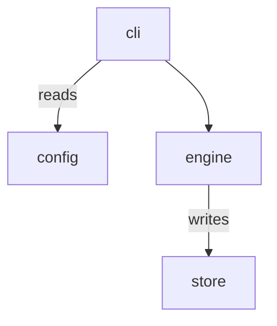
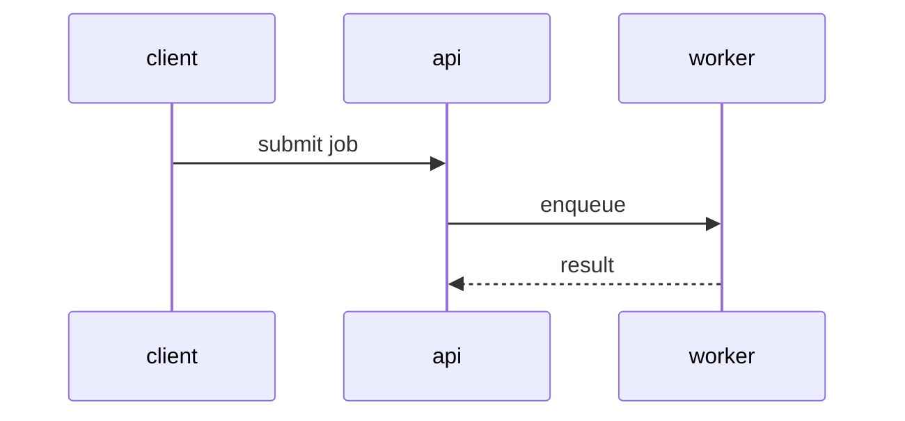
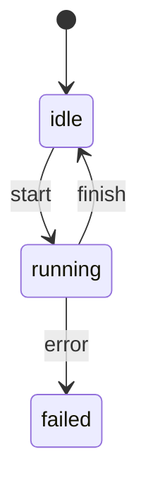
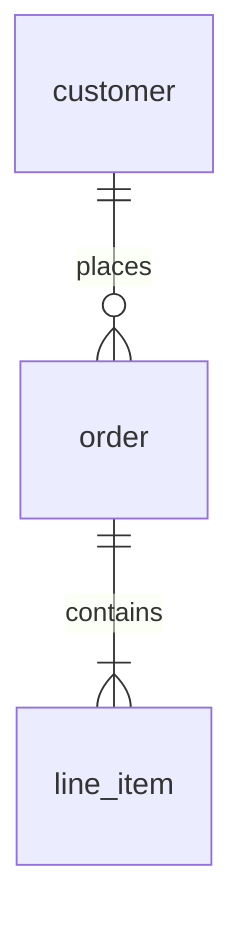
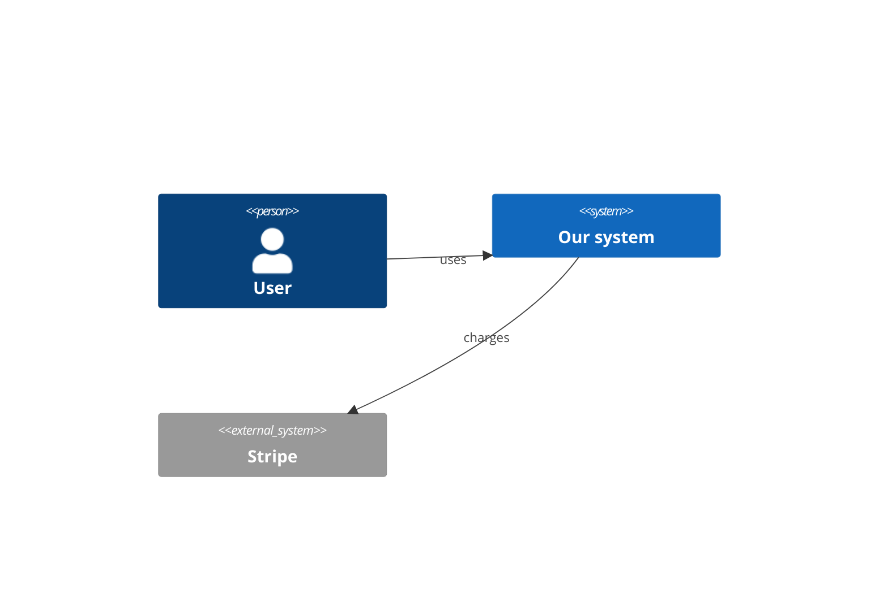

# Diagram vocabulary

A project's nature decides the diagram. A state machine drawn as a dependency
graph is worse than no diagram: it answers a question nobody asked and hides
the one that matters.

The vocabulary is **closed**. "Pick whatever fits" sounds flexible but means
every project invents a private dialect, and then an agent cannot infer what an
arrow means without being told. Five kinds, fixed semantics.

## Choosing

| Project nature | `kind` | Unlabeled edge means | Use when the first question is |
|---|---|---|---|
| Libraries, services, CLIs, monorepos | `flowchart` | `depends-on` | "what are the parts and what needs what" |
| Request lifecycles, protocols, agent loops | `sequenceDiagram` | `message` | "what happens in what order, between whom" |
| Editors, jobs, sessions, connections | `stateDiagram-v2` | `transition` | "what states exist and how do we leave them" |
| CRUD apps, ERP, data platforms | `erDiagram` | `relation` | "what entities exist and how do they relate" |
| Distributed systems, integrations | `C4Context` | `boundary` | "where does our system end" |

Decision rule when two fit: **pick the one that answers the question a newcomer
asks first.** For a payments service that is "what calls what" (`flowchart`),
not "what tables exist" (`erDiagram`) — even though both are true.

A project may need a second view. That is a second map file reached through a
`map:` drill-down, never a second diagram in one file.

## `flowchart` — the default

Most software is mapped by responsibility and dependency.

- `edges: depends-on`, then `edge-kinds:` for anything more specific.
- Use `subgraph` for domain grouping; subgraph ids are not nodes and need no
  ledger entry.
- Fix `TD` and keep edits additive. Mermaid auto-layout reshuffles on change,
  and a reshuffled diagram destroys the human's spatial memory of it.

## `sequenceDiagram` — order and participants

Declare every participant with `participant` — that is what the validator reads
as the node set. Message text is free-form; edge-label vocabulary is not
enforced here.

## `stateDiagram-v2` — lifecycles

`[*]` is not a node and needs no ledger entry. Transition labels are trigger
names, free-form.

Highest-value ledger lines here are `INVARIANT` (which states are unreachable)
and `CONTRACT` (what a consumer may assume on entry).

## `erDiagram` — data models

Entity names are the node set. This is the kind that scales worst in one file —
an ERP will exceed 30 entities immediately, so plan drill-downs by domain from
the start.

## `C4Context` — system boundary

Ids come from the first argument of each declaration. Use this only for the
outermost view; the interior belongs in a `flowchart` drill-down.

External systems are legitimate nodes with no code: `path: -`, with `role:`
naming the integration surface.

## Parser support — know the edges of the tool

The validator reads the subset shown above. Unrecognized syntax is **ignored,
not rejected** — a false failure would teach users to bypass the validator, and
a bypassed validator protects nothing. The practical consequence: a node
introduced through exotic syntax may escape the diagram↔ledger check. Keep to
the forms in this file and that cannot happen.
