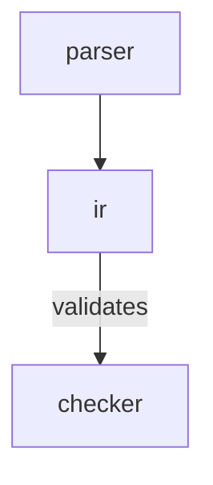

# project-map format v1

`scripts/validate_project_map.py` is the canonical definition. This document
mirrors it for human readers; if they disagree, the validator wins.

## File shape

A map file is Markdown with exactly four parts, in order.

````markdown
# <project name> — map

<!-- project-map: v1 -->

## Meta
- kind: flowchart
- edges: depends-on
- edge-kinds: reads, writes, validates

## Map



## Nodes

### parser
- role: turns source text into tokens
- path: src/parser/
- INVARIANT: never allocates for input under 4 KiB
- REJECTED: hand-written lexer — regex backtracking blew up on nested groups

### ir
- role: language-neutral intermediate representation
- path: src/ir/mod.rs
- CONTRACT: every node has a stable id that survives re-parse

### checker
- role: rejects malformed IR before codegen
- path: src/checker/
- CONSTRAINT: must stay under 50 ms for a 10k-node IR (CI budget)
````

### 1. Format marker — required

`<!-- project-map: v1 -->` anywhere in the file. It is a version gate: a future
format bump changes the marker so old validators fail loudly instead of
mis-parsing.

### 2. `## Meta` — required

| Key | Required | Meaning |
|---|---|---|
| `kind` | yes | Diagram kind. Closed vocabulary — see `diagram-vocabulary.md`. |
| `edges` | yes | What an **unlabeled** edge means in this map. |
| `edge-kinds` | no | Comma-separated labels a **labeled** edge may use. |

`edges:` exists because `A --> B` is ambiguous — calls? depends on? data flows
to? owns? An agent reading an undeclared arrow learns nothing it can act on.

### 3. `## Map` — required

Exactly **one** ```mermaid block per map file. More than one is an error: a
second diagram is a second source of truth. To show more, use a `map:`
drill-down.

Node ids in the diagram must be `[a-z][a-z0-9_-]*` and must match ledger
headings one-to-one, in both directions:

- node in diagram, no ledger entry → **error**
- ledger entry, not in diagram → **error**

Keep labels short. A label is a name, not an explanation.

### 4. `## Nodes` — the ledger

One `### <node-id>` per node, followed by `- key: value` lines. Values may wrap
onto indented continuation lines.

| Key | Repeats | Required | Purpose |
|---|---|---|---|
| `role` | no | **yes** | One line: what this node is responsible for. |
| `path` | yes | **yes** | Real path or glob. `-` means "no code behind this node". |
| `map` | no | no | Drill-down map file for this node's interior. |
| `OWNER` | no | no | Who decides changes here. |
| `INVARIANT` | yes | no | Must always hold. Breaking it is a bug, not a tradeoff. |
| `CONSTRAINT` | yes | no | External limit shaping the design (budget, protocol, deadline). |
| `REJECTED` | yes | no | Alternative considered and rejected, **with the reason**. |
| `CONTRACT` | yes | no | Promise to other nodes: shape, ordering, guarantees. |

Unknown keys are an error. The vocabulary is closed on purpose: freeform notes
degrade into prose nobody maintains, and a closed set is greppable.

Lowercase keys are mechanical (a machine checks them). UPPERCASE keys are the
'why' payload — the part that cannot be recovered from code at any cost.

## Why the ledger and not `%%` comments

Mermaid has no node-attached comment. The three candidates and their outcomes:

| Method | Human sees it | Agent sees it | Verdict |
|---|---|---|---|
| `%%` comment line | **No** — renderers strip comments | Yes | Breaks the human half |
| Text inside the node label | Yes | Yes | Diagram becomes a wall of prose |
| `click` tooltip | Unreliable — GitHub sanitizes `click` | Yes | Not portable |

The ledger keyed by node id is the only option where both audiences see the
same 'why'. The human path is diagram → node of interest → its ledger entry,
which is also the natural drill-down order.

`%%` comments remain legal for **agent-only hints** that a human does not need.

## Scale: drill-down

Above 30 nodes the validator warns. Mermaid's auto-layout turns a large
flowchart into spaghetti, and a diagram a human cannot hold fails the entire
purpose. Split instead:

```markdown
### billing
- role: invoicing, dunning, tax
- path: src/billing/**
- map: PROJECT.billing.md
```

`PROJECT.billing.md` is a complete map file — its own marker, meta, single
diagram, and ledger. The validator recurses into it and resolves `path:` values
against the same project root.

## Rot detection — what is and is not checked

Verified mechanically by `validate_project_map.py`:

- every `path:` resolves to something on disk
- diagram ↔ ledger correspondence, both directions
- node id syntax, duplicate entries
- labeled flowchart edges are declared in `edges:`/`edge-kinds:`
- `map:` drill-down targets exist, and recurse cleanly
- `kind:` matches the mermaid block's opening keyword

Verified mechanically by `scan_structure.py --compare`:

- `missing-edge` — the code imports across a node boundary the map does not
  draw. This is the check that keeps a map *accurate* rather than merely
  well-formed, and it is the one that fails a commit.
- `uncovered` — source files no node's `path:` claims, reported with a coverage
  percentage. New code that nobody mapped shows up here.
- `stale-edge` — an edge with no import evidence. **Reported, never fatal**: a
  spawn, an HTTP call, or a queue write is a real dependency with no import.

Not verifiable, and never to be claimed:

- whether a node's `role:` still describes what the code does
- whether an `INVARIANT` still holds
- whether a missing node should exist
- any structure in a language the scanner does not parse (it handles Python,
  TS/JS, Go, Rust), or wiring that is dynamic — DI containers, runtime
  registries, string-keyed imports

Edge-label vocabulary is enforced for `flowchart` only. In `sequenceDiagram`,
`stateDiagram-v2`, and `erDiagram` a label is a message, trigger, or
cardinality name — free text by nature.

## Usage

```bash
# format, path rot, diagram <-> ledger correspondence
python scripts/validate_project_map.py                       # defaults to ./PROJECT.md
python scripts/validate_project_map.py PROJECT.md --strict   # warnings become errors
python scripts/validate_project_map.py docs/PROJECT.md --root .

# accuracy: real import graph vs what the map draws
python scripts/scan_structure.py --compare PROJECT.md
python scripts/scan_structure.py --suggest --depth 2         # bootstrap a new map
```

Exit codes for both: `0` clean, `1` problems (validator: errors, or warnings
under `--strict`; scanner: `missing-edge` found), `2` bad invocation or an
unreadable map. Stdlib-only Python 3.8+, so they run wherever the user already
has Python — no install step, which is the point: a skill that cannot run on
first contact will not be used.
